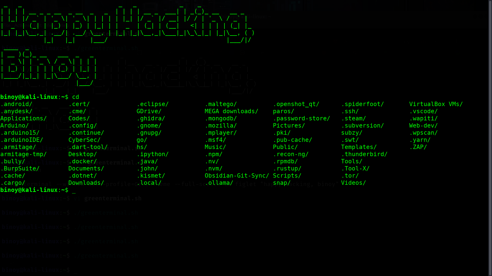
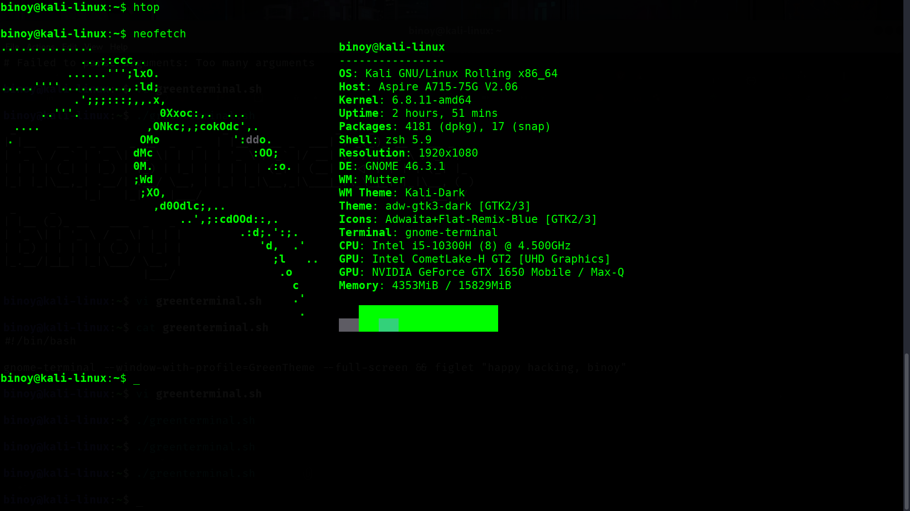
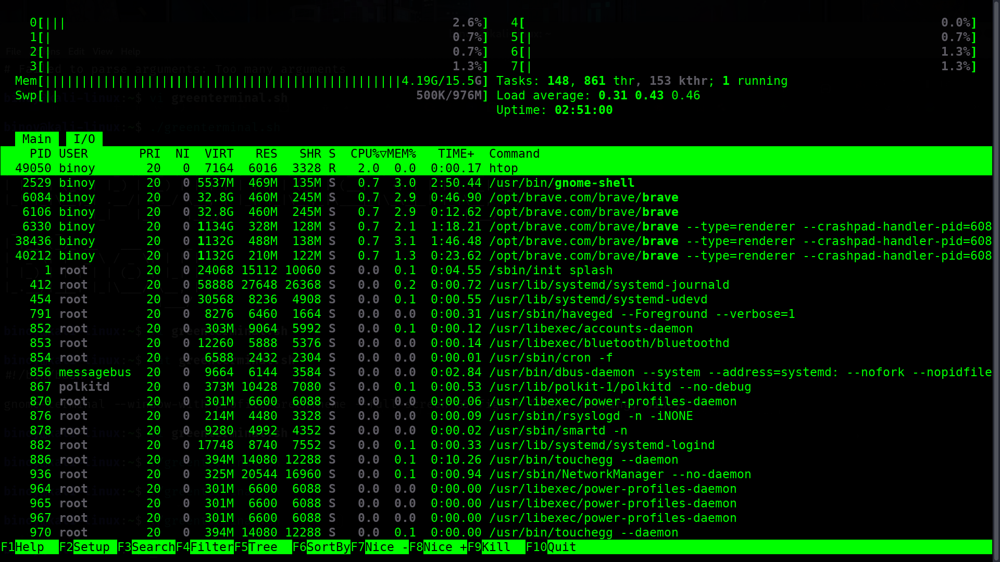
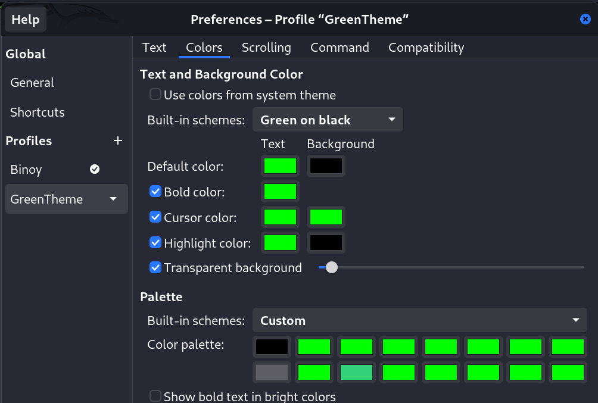

# Cool Green Terminal Setup

Welcome to the repository for creating a cool-looking terminal setup with a green theme, fullscreen mode, and a custom welcome message using the `figlet` command! This setup is designed to enhance your terminal experience and make it visually appealing.







## Features

- **Green Theme**: A visually pleasing green text on a black background.
- **Fullscreen Mode**: Start your terminal in fullscreen for a distraction-free experience.
- **Custom Welcome Message**: Greet yourself with a personalized message using `figlet`.

## Prerequisites

- **GNOME Terminal**: Ensure you have GNOME Terminal installed on your system.

- **Figlet**: Install `figlet` to display custom text banners.

```sh
sudo apt-get install figlet
```

### Setup Instructions

## Step 1:

1. Create a Custom Profile in GNOME Terminal
   Open GNOME Terminal.
2. Go to Preferences (accessible from the menu button or Ctrl + Shift + P).
3. Click on + to add a new profile.
4. Name the profile GreenTheme.
5. Go to the Colors tab and customize the colors:

   - Uncheck Use colors from system theme.
   - Set the text color to green (e.g., #00FF00).
   - Set the background color to black (e.g., #000000).

   - All set all the other colors to green (e.g., #00FF00) as given in the screenshot below.
   

## Step 2:

1. Create a file named `greenterminal.sh` with the following content:
```sh
#!/bin/bash

gnome-terminal --window-with-profile=GreenTheme --full-screen -- bash -c 'figlet "Happy Hacking, $(whoami)"; exec bash'
```
or download the `greenterminal.sh` file from this repo.

2. Make the script executable:
```sh
chmod +x greenterminal.sh
```

## Step 3:

Execute the script to open the terminal with the custom setup:
```sh
./greenterminal.sh
```